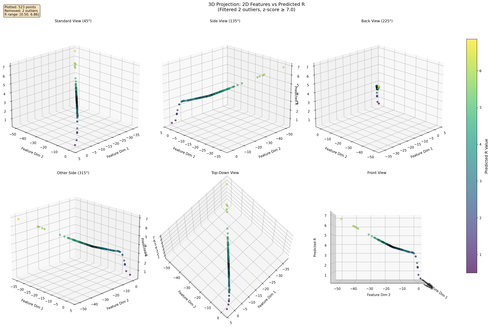

# Overview

This is official MORGAN article experiment implementation, makes estimation of the Chebychev radius for light inverse rendering task.

# Usage

* load data and checkpoints to .data and .checkpoints dirs from: [here](https://drive.google.com/drive/folders/1zWkmzOIIwueeUL0ryzK6FU8TtW6g4T6W)

* setup env

both for python 3.8 and 3.10

```bash
python -m venv .venv && source .venv/bin/activate
pip install -r requirements.txt
pip install -e git+https://github.com/rom1504/taming-transformers.git#egg=taming-transformers-rom1504
```

* launch experiments

To count metrics using DRMNet:

```bash
# python --version = 3.8
python measure_metrics.py
```

To estimate Chebychev radius use:

```bash
# python --version = 3.10
python train.py --device=cuda:7 --learning_rate=3e-4 --batch_size=16 --log_dir=storage/results-new-lr-3e-4/ --epochs 2000
```

# Results



# Acknowledgments

We used [DRMNet](https://github.com/kyotovision-public/DRMNet) as a base of our repository and experiment, we thank the creators of this net, for sharing their codes with science society.
